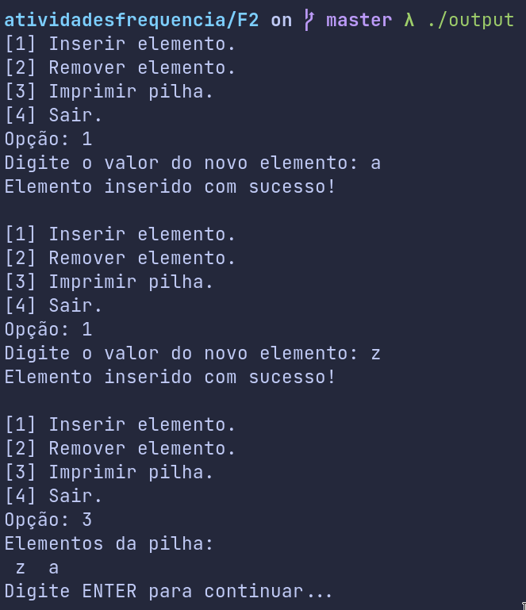

---
author:
- "Luís Augusto Simas do Nascimento"
- "RA: 790828"
title: F2 - Implementação de um TAD Pilha
date: 17/05/2021
classoption: a4paper
geometry: margin=1in
fontsize: 12pt
output: pdf_document
---

# Diagrama das estruturas
A pilha foi implementada utilizando **alocação dinâmica encadeada** de memória. Cada nó que compõe os elementos da pilha possui um campo para armazenar um dado valor e outro campo para armazenar um ponteiro para o próximo elemento da pilha. A estrutura da pilha é formada por apenas um ponteiro que aponta para o nó do topo, dessa forma é possível acessar todos os elementos da pilha através dos ponteiros para os próximos elementos. Vale destacar que enquanto todas as operações de uma pilha são realizadas apenas com o elemento do topo, essa implementação garante um fácil e rápido acesso justamente a esse elemento.

# Prints da execução
As imagens a seguir mostram a execução do programa desenvolvido realizando as operações implementadas (inserção, remoção, imprimir). Note que nas operações de inserção e remoção são exibidas mensagens de erro caso a pilha esteja cheia ou vazia, respectivamente.

